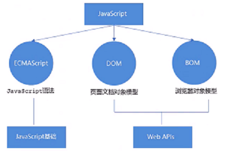

# Learning-js

*learning materials of js*  

---

> ## JavaScript部分  
1. js的介绍及基本语法变量，运算符；  
2. js的流程控制：分支语句、循环、顺序结构；  
3. 数组；  
4. 函数；  
5. 内置对象；  
6. 内置对象及一些方法；  

<br>

> ## DOM、BOM部分  
1. DOM  
   - DOM简介  
   - 获取元素  
   - 事件基础  
   - 操作元素  
   - 节点操作  
2. BOM  

<br>

---

# JavaScript部分
- *ECMAScript* 标准 --- js的基本语法  
- *DOM* --- *Document Object Model* 文档对象模型  
- *BOM* --- *Browser Object Model* 浏览器对象模型  
<br>

> ## 一、介绍  

| 语言 | 作用 |
| :-: | :-: |
| HTML | 标记语言，展示数据 |  
| CSS | 美化页面 |  
| JavaScript | 控制页面，用户和浏览器交互 |  

1. js介绍  
  - 脚本语音、解释性语言、动态类型、基于对象  
  - js **原名** *LiveScript*  
  - **作用**：解决用户和浏览器之间的交互的问题  

2. js代码可以在**三个地方**书写  
   1. 在html文件中用`script`标签  
   ``` html
   <script>
   // js code
   alert("使用script标签弹窗！");
   </script>
   ```

   1. 在html标签中  
   ``` html
   <!--
     html code
     onclick后面的部分就是js代码
     -->
   <input type="button" value="按钮" onclick="alert('通过html标签弹窗');">
   ```

   1. 在外部文件中，需要在html页面中引入（在`script`标签中的`src`属性写入js文件的路径）
   ``` javascript
   // test.js
   alert("使用外部js文件弹窗");

   // index.html
   <script src="test.js"></script>
   ```

3. js代码**注意问题**
   1. 在一对`script`的标签中有错误的js代码，那么该错误后面的js代码不会执行  
   ``` html
   // 错误代码，后面不会执行
   <script>
     alert("我是错的;
     alert("我是对的");
   </script>
   ```

   2. 如果一对`script`标签中有错误，不会影响其他的`script`标签  
   ``` html
   <script>
     alert("我是错的;
     alert("我是对的 1");  // 不会执行
   </script>
   <script>
     alert("我是对的 2");  // 正常执行
   </script>
   <script>
     alert("我是对的 3");  // 正常执行
   </script>
   ```

   3. `script`标签中可以写什么内容
      1. type="text/javascript" 是标准写法
      ``` html
      <script type="text/javascript">
        alert("type 1");
      </script>
      ```
      2. language="JavaScript" 也可以
      ``` html
      <script language="JavaScript">
        alert("type 2");
      </script>
      ```
      3. 都不写也可以（因为 html 遵循h5标准）
      ``` html
      <!DOCTYPE html>
      <script>
        alert("type 3");
      </script>
      ```
      4. 有可能出现：*type* 和 *language* 属性都写
      ``` html
      <script type="text/javascript" language="JavaScript">
        alert("type 4");  // 两种属性都写避免浏览器解析出现意外错误
      </script>
      ```
      5. `script`标签在页面中可以出现多对  

      6. `script`标签一般放在`body`标签的最后（与加载顺序和外部引入有关），有时会放在`head`标签中  

      7. 如果`script`标签是引入外部js文件的作用，那么这对标签这种不要写任何的js代码；
      如果要写代码，重新写一对`script`标签再写  
<br>

> ## 二、变量  
1. 变量声明  
   - `var` 声明**变量**  
   - `let` 声明的变量**只在**let所在的代码块`{}`内有效，在代码块外不能访问(ES6)  
   - `const` 声明**常量**，必须进行**初始化**并且**不可修改**  

   1. js中存储数据使用变量的方式 (名字，值 --> 数据)  

   2. js中声明变量用`var` --> 存储数据，数据应该有对应的数据类型  

   3. js中字符串类型的值都用**单引号**或**双引号**  

   4. 变量声明 (声明不赋值`var a;`)  
      变量初始化 (声明并赋值`var a = 1;`)  
   ``` javascript
   var a;  // 变量的声明
   var b, c, d;

   a = 1;  // 变量的赋值
   b = 2;
   c = 3;
   d = 4;

   var e = 5;  // 变量的初始化
   var f = "小白";
   var g = true;
   var h = null;
   var i = new Object();
   ```

2. 代码规范  
   1. js每一行结束用**分号 ';'**  
   2. js的变量名**大小写敏感** (即`a`与`A`是两个变量)  
   3. 变量名命名规范:   
      - 一般以 **字母、\$、\_** 开头;  
      - 中间或后面可以有 **\$、字母、数字**;  
      - 变量名一般是**小写**的;  
      - 变量名如果有多个单词，**第一个单词**的首字母是**小写**的，后面所有单词的首字母都是**大写**的。这种命名方式称为***驼峰命名法***  
      ``` javascript
      // example
      var bigNumber;  // 驼峰命名法(js、go等)
      var big_number;  // 下划线命名法(python、c等)
      ```
      - 不能使用关键字(如`var、break`等)

3. 交换两个变量的值  
   1. 方法1：使用第三方  
   ``` javascript
   var num1 = 10;
   var num2 = 20;
   var temp;
   temp = num1;
   num1 = num2;
   num2 = temp;
   console.log(num1, num2);
   ```
   2. 方法2：一般用于数字的交换  
   ``` javascript
   var num1 = 10;
   var num2 = 20;
   num1 = num1 + num2;  // 30 = 10 + 20
   num2 = num1 - num2;  // 10 = 30 - 20
   num1 = num1 - num2;  // 20 = 30 - 10
   console.log(num1, num2);
   ```
   3. 方法3：位运算  
   ``` javascript
   var num1 = 10;
   var num2 = 20;
   num1 = num1 ^ num2;
   num2 = num1 ^ num2;
   num1 = num1 ^ num2;
   console.log(num1, num2);
   ```

4. 注释  
   1. 单行注释：`// abcdefg`  
   2. 多行注释：`/* abcdefg */`  

5. 数据类型  
   1. js中的原始数据类型  
   ``` javascript
   number, string, boolean, null, undefined, object
   /*
   * number: 数字类型(整数和小数)
   * string: 字符串类型(值一般是用单引号或双引号括起来)
   * boolean: 布尔类型(值只有两个, true(真1),false(假0))
   * null: 空类型, 值只有一个: null; 一个对象指向为空，则此时可以赋值为null
   * undefined: 未定义, 值只有一个: undefined
   * object: 对象
   */

   // undefined情况
   // 1. 变量声明了没有赋值
   // 2. 函数没有明确返回值
   var num;
   console.log(num);  // 输出 undefined
   console.log(num + 10);  // 输出 NaN --- not a number
   ```  
   2. 获取变量类型
   ``` javascript
   // typeof 用法
   // 1. typeof 变量名
   // 2. typeof(变量名)

   var num = 10;
   var str = "小明";
   var flag = true;
   var nll = null;
   var undef;
   var obj = new Object();

   console.log(typeof num);  // number
   console.log(typeof str);  // string
   console.log(typeof flag);  // boolean
   console.log(typeof nll);  // 不是null(是object)
   console.log(typeof undef);  // undefined
   console.log(typeof obj);  // object
   ```  

6. **Number** 类型  
   - 不要用小数验证小数  
   - 不要用NaN验证NaN  
   <br>

   1. js可以表示的进制  
   ``` javascript
   var num1 = 12;  // 十进制
   var num2 = 012;  // 八进制(以0开头)  十进制的10
   var num3 = 0x12;  // 十六进制(以0x开头)  十进制的18
   ```  
   2. 数字类型的范围：最小值和最大值  
   ``` javascript
   console.log(Number.MAX_VALUE);  // 最大值
   console.log(Number.MIN_VALUE);  // 最小值
   Infinity;  // 无穷大
   -Infinity;  // 无穷小
   NaN;  // not a number  NaN != NaN
   isNaN();  // is 'not a number'  验证是否是NaN(不是数字): 是数字输出false; 不是数字输出true
   console.log(isNaN(10));  // false
   console.log(isNaN("你好"));  // true
   ```  
   3. 小数计算  
   ``` javascript
   // 小数的计算不一定精确
   // 原因：小数的二进制存储不一定精确
   var x = 0.1;
   var y = 0.2;
   var sum = x + y;
   console.log(sum == 0.3);  // 输出为false
   ```  

7. **string** 类型  
   1. 字符串长度  
   ``` javascript
   var str = "abcdefg";
   console.log(str.length);  // 输出 7
   ```
   2. 字符串拼接
   ``` javascript
   // 1. 使用 '+' 连接多个字符串
   var str1 = "你";
   var str2 = "好";
   console.log(str1 + str2);  // 输出 "你好"(string类型)

   // 2. 如果一个是字符串其他是数字则还是拼接
   var str = "10";
   var num = 2;
   console.log(str + num);  // 输出 102(string类型)

   // 3. 如果一个是字符串另一个是数字则计算加减(隐式转换: 自动将字符串类型转换成了数字类型)
   var str = "10";
   var num = 2;
   console.log(str - num);  // 输出 8(number类型)
   console.log(str * num);  // 输出 20(number类型)
   ```
   3. 转义符  

   | 符号 | 字符 |
   | :-: | :-: |
   | \\b | 退格 |
   | \\f | 走纸换页 |
   | \\n | 换行 |
   | \\r | 回车 |
   | \\t | 横向跳格(ctrl+I) |
   | \\' | 单引号 |
   | \\" | 双引号 |
   | \\\ | 反斜杠 |

8. **boolean**类型、**undefined** 及 **null**  
   1. Boolean类型  
      - Boolean类型值: true / false
      - 计算机内部存储: true = 1 / false = 0
   2. undefined和null  
      - undefined表示一个声明了没有赋值的变量，变量只声明的时候值默认为undefined
      - null表示一个空，变量的值如果想要为null，必须手动设置

9. **object**类型  
   - **pass**

10. 类型转换  
    1. 其他类型转**数字**类型(三种)  
    ``` javascript
    // 1. 转整数 parseInt()
    // 数字直接转 / 数字开头转 / 字母开头不转 / 小数取整
    console.log(parseInt("10"));  // 10
    console.log(parseInt("10fdsfd"));  // 10
    console.log(parseInt("g10"));  // NaN
    console.log(parseInt("1fds0"));  // 1
    console.log(parseInt("10.98"));  // 10
    console.log(parseInt("10.98fdsfd"));  // 10

    // 2. 转小数 parseFloat()
    // 无小数部分则显示整数
    console.log(parseFloat("10"));  // 10
    console.log(parseFloat("10fdsfd"));  // 10
    console.log(parseFloat("g10"));  // NaN
    console.log(parseFloat("1fds0"));  // 1
    console.log(parseFloat("10.98"));  // 10.98
    console.log(parseFloat("10.98fdsfd"));  // 10.98

    // 3. 转数字 Number()
    // 带有字母转换结果都是NaN (转换方式比1、2严格)
    console.log(Number("10"));  // 10
    console.log(Number("10fdsfd"));  // NaN
    console.log(Number("g10"));  // NaN
    console.log(Number("1fds0"));  // NaN
    console.log(Number("10.98"));  // 10.98
    console.log(Number("10.98fdsfd"));  // NaN
    ```
    2. 其他类型转**字符串**类型  
    ``` javascript
    // 1. object.toString()
    var num1 = 10;
    console.log(num1.toString());  // 10 (string类型)

    // 2. String()
    var num2 = 20;
    console.log(String(num2));  // 20 (string类型)

    // 如果变量有意义，调用.toString()转换
    // 如果变量没有意义，调用String()转换
    var num3;
    var num4 = null;
    console.log(num3.toString);  // 报错
    console.log(num4.toString);  // 报错
    console.log(String(num3));  // undefined
    console.log(String(num4));  // null
    ```
    3. 其他类型转**布尔**类型  
    ``` javascript
    // 1. Boolean(value);
    console.log(Boolean(1));  // true
    console.log(Boolean(0));  // false
    console.log(Boolean(11));  // true
    console.log(Boolean(-10));  // true
    console.log(Boolean("哈哈"));  // true
    console.log(Boolean(""));  // false
    console.log(Boolean(null));  // false
    console.log(Boolean(undefined));  // false
    ```

11. 操作符  
    1. 算数运算符  
       ` +, -, *, /, % `  
       算数运算表达式：由算数运算符连接起来的表达式  
    2. 一元运算符  
       只需要一个操作数就可以运算的符号 ` ++, -- `  
    3. 二元运算符  
       只需要两个操作数就可以运算的符号 ` +, -, *, /, % `  
    4. 三元运算符  
       只需要三个操作数就可以运算的符号 ` a ? x : y `  
    5. 复合运算符  
       ` +=, -=, *=, /= `
       复合运算表达式：由复合运算符连接起来的表达式  
    6. 关系运算符  
       ` >, <, >=, <=, ==, ===, !=, !== `  
       ``` javascript
       // '==','!=': 不严格; '===', '!==': 严格
       var str = "5";
       var num = 5;
       console.log(str == num);  // 输出为 true
       console.log(str === num);  // 输出为 false

       // == 和 != 比较类型若不同，先尝试转换类型再作值比较，最后返回值比较结果；
       // === 和 !== 只会在相同类型下才会比较其值(若类型不同则一定不同)
       ```
    7. 逻辑运算符  
       ``` javascript
       // && -- 逻辑与
       // || -- 逻辑或
       // ! -- 逻辑非
       ```
    8. 优先级
       ``` javascript
       // 1. () 优先级最高
       // 2. 一元运算符 ++ -- ！
       // 3. 算术运算符 先* / 后+ -
       // 4. 关系运算符 > >= < <= 
       // 5. 二元运算符 == != === !==
       // 6. 逻辑运算符 先&& 后||
       // 7. 赋值运算符 =
       ```

12. 语句、表达式、字面量  
<br>

> ## 三、流程控制  
1. 流程控制  
   1. 顺序结构：从上到下，从左到右执行的顺序  
   2. 分支结构：if语句，if-else语句，switch-case语句，三元表达式语句  
   3. 循环结构：while循环，do-while循环，for循环，for-in循环  
2. 分支语句  
   ``` javascript
      // 1. if 语句
      if (表达式) {
         代码;
      }

      // 2. if-else 语句
      if (表达式) {
         代码1;
      }
      else {
         代码2;
      }

      // 3. if-else if -else 语句
      if (表达式1) {
         代码1;
      }
      else if (表达式2) {
         代码2;
      }
      else {
         代码3;
      }

      // 4. 三元表达式
      // 变量 = 表达式1 ? 表达式2 : 表达式3;
      // 判断表达式1结果: true 则执行 表达式2;
      //                 false 则执行 表达式3;

      // 5. switch-case 语句
      // 注意：case的比较使用的是'==='和'!=='(严格的比较)
      switch(表达式) {
         case 值1: 代码1; break;
         case 值2: 代码2; break;
         case 值3: 代码3; break;
         ... ...
         default: 代码n;
      }
   ```
3. 循环语句  
   ``` javascript
      // 1. while 循环
      while(条件) {
         循环体;
         计数器++;
      }
      // 注意：先判断条件，再执行循环/跳出循环

      var i = 0;  // example
      while(i < 10) {
         console.log(i);
         i++;
      }

      // 2. do-while 循环
      do{
         循环体;
      }while(条件)
      // 注意：先执行一次循环体再判断条件，...

      var i = 0;
      do{
         console.log(i);
         i++;
      }while(i<10)

      // 3. for 循环
      for(表达式1;表达式2;表达式3) {
         循环体;
      }
   ```
4. **break**、**continue** 关键字
   1. **break**  
      遇到 break 则立刻跳出当前循环  
   2. **continue**  
      遇到 continue 则立刻开始下次循环  
<br>

> ## 四、数组  

- 数组索引从`0`开始  
- 数组长度 `arr.length`

1. 通过构造函数创建数组  
   ``` javascript
   // var array(数组名) = new Array(数组长度);
   var empty_array = new Array();  // 空数组
   console.log(empty_array);  // 输出Array(0)或[]

   var my_array1 = new Array(5);
   console.log(my_array);  // 输出Array(5), 其中每个值都是undefined

   // Array(一个数字)表示数组长度;
   // Array(多个数字)表示数组元素;
   var array1 = new Array(5);  // 数组长度为5, 数组元素为undefined
   var array2 = new Array(1, 2, 3, 4, 5);  // 数组长度为5, 数组元素为[1, 2, 3, 4, 5]
   ```
2. 通过字面量创建数组  
   ``` javascript
   // var 数组名 = [];
   var my_array2 = [];  // 空数组
   ```
3. 注意问题  
   1. 数组中存储的数据类型一定是一样的吗？
      ``` javascript
      // 类型可以不一样
      var arr = [10, "哈哈", true, null, undefined, new Object()];
      console.log(arr);
      ```
   2. 数组的长度是否可以改变？
      ``` javascript
      // 长度可以改变
      var arr = [];  // length = 0
      arr[0] = 1;  // length = 1
      arr[1] = 2;  // length = 2
      console.log(arr.length);
      ```
4. 操作
   1. 遍历数组  
   ``` javascript
   // for 循环遍历数组
   var arr = [10, 20, 30, 40, 50];
   for (var i = 0; i < arr.length; i++) {
      console.log(arr[i]);
   }
   ```
   2. 排序
   ``` javascript
   // 冒泡排序
   var arr = [9, 1, 2, 5, 8, 7, 6, 4, 3];
   for (var i = 0; i < arr.length - 1; i++) {
      for (var j = 1; j < arr.length - 1 - i; j++) {
         if(arr[j] > arr[j + 1]) {  // 从小到大
            var temp = arr[j];
            arr[j] = arr[j + 1];
            arr[j + 1] = temp;
         }
      }
   }
   console.log(arr);
   ```
5. 数组的一些方法
   1. `push()`  
      **push()** 方法可以向数组的末尾添加一个或多个元素，并返回新的长度
      ``` javascript
      var arr = [1, 2, 3, 4]
      newLength = arr.push(5, 6);
      console.log(arr);  // [1, 2, 3, 4, 5, 6]
      console.log(newLength);  // 6
      ```
   2. `unshift()`  
      **unshift()** 方法可以向数组的开头添加一个或多个元素，并返回新的长度
      ``` javascript
      var arr = [1, 2, 3, 4]
      newLength = arr.unshift(5, 6);
      console.log(arr);  // [5, 6, 1, 2, 3, 4]
      console.log(newLength);  // 6
      ```
   3. `pop()`  
      **pop()** 方法可以删除并返回数组的最后一个元素  
      ``` javascript
      var arr = [5, 4, 3, 2]
      lastNumber = arr.pop();
      console.log(arr);  // [5, 4, 3]
      console.log(lastNumber);  // 2
      ```
<br>

> ## 五、函数  
1. 函数
   1. 函数的作用：代码的重用  
   2. 函数的定义  
      ``` javascript
      function 函数名字() {
         函数体;
      }
      ```
   3. 函数的调用：`函数名();`  
   4. 注意问题  
      1. 需要先定义后使用  
      2. 不能重名  
      3. 遵循驼峰命名法  
2. 参数  
   1. 形参  
      函数在**定义**的时候小括号里的变量叫形参  
   2. 实参  
      函数在**调用**的时候小括号里传入的值叫实参，实参可以是变量也可以是值  
   ``` javascript
   // example
   function consoleSum(x, y) {
      var sum = x + y;  // 计算和
      console.log(sum);  // 输出
   }

   var x = parseInt(prompt("输入第一个数字"));
   var y = parseInt(prompt("输入第二个数字"));
   consoleSum(x, y);
   ```
3. 返回值  
   `return`
4. `arguments`对象 - - 伪数组  
   使用`arguments`对象可以获取传入的参数的值
   ``` javascript
   // example
   function f1() {
      // console.log(arguments);
      // console.log(arguments.length);  // 获取传入的参数的个数
      var sum = 0;  // 求传入的所有参数的和
      for(var i = 0; i < arguments.length; i++) {
         sum += arguments[i];
      }
      return sum;
   }
   var result = f1(1, 2, 3, 4, 5);
   console.log(result);  // 15
   ```
5. 函数的其他定义方式  
   - 命名函数  
   - 匿名函数  
   1. 函数声明 - - 函数定义  
      ``` javascript
      // example
      function f1() {  // 定义
         console.log("函数定义1");
      }

      f1();  // 调用
      ```
   2. 匿名函数 - - 函数表达式  
      ``` javascript
      // 把一个函数给一个变量，此时形成了函数表达式
      // 注意：函数表达式最后需要加分号
      var 函数 = 匿名函数;

      // example
      var f2 = function () {  // 定义
         console.log("函数定义2");
      };

      f2();  // 调用
      ```
   3. 函数的自调用 - - 声明的同时调用(一次性的)
      ``` javascript
      // 一次性 - - 安全(避免重名、冲突)

      var f1 = function(){console.log("函数定义3")};
      f1();

      // example
      // 上式可以表达成如下
      (function(){console.log("函数定义3")})();
      ```
   4. 区别  
      函数定义：重名则直接覆盖(不管在哪里调用)  
      函数表达式：重名则类似变量赋值(按顺序调用、覆盖)  
6. 函数的数据类型  
   1. 函数的数据类型为`function`
   ``` javascript
   function f1(){
      console.log("haha");
   }
   console.log(typeof(f1));  // 输出 function
   ```
   2. 函数作为参数  
   - 函数可以作为参数使用，如果一个函数作为参数，那么这个参数叫做回调函数  
   ``` javascript
   function f1(){
      console.log("haha");
   }
   function f2(fn){
      fn();
   }
   f2(f1);  // 输出 haha
   ```
   3. 函数作为返回值  
   ``` javascript
   function f1(){
      return function (){
         console.log("hahaha");
      }
   }
   var ff = f1();  // 此时 ff 是一个函数了
   ff();  // 输出 hahaha
   ```
7. 作用域  
   1. 全局变量：用`var`声明的变量一般都是全局变量  
   2. 局部变量：函数内部定义的变量为局部变量  
   3. 隐式全局变量：不加`var`关键字修饰
   ``` javascript
   // 1. 全局/局部 区别
   var a = 1;  // 全局
   function f1(){
      var b = 2;  // 局部
      console.log(a);  // 1
      console.log(b);  // 2
   }
   f1();
   console.log(a);  // 1
   console.log(b);  // 报错

   // 2. 隐式全局变量
   function f1(){
      number = 1;
   }
   console.log(number);  // 可以调用 输出 1

   // 注意：全局变量是不能被删除的；隐式全局变量是可以被删除的
   var num1 = 1;
   num2 = 2;
   delete num1;
   delete num2;
   console.log(num1);  // 1
   console.log(num2);  // undefined
   ```
   4. 全局作用域：全局变量的使用范围  
   5. 局部作用域：局部变量的使用范围  
   6. 块级作用域：一对`{}`可以看作是一块 - - `let`关键字可以限制变量的作用域为块级作用域  
8. 作用域链  
   ``` javascript
   // 需要使用的变量首先在当前级作用域寻找
   // 没有则在上一级作用域寻找
   // 0级作用域没有找到则为undefined
   var num = 10;  // 0级作用域
   function f1(){
      var num = 20;  // 1级作用域
      function f2(){
         var num = 30;  // 2级作用域
         function f3(){
            var num = 40;  // 3级作用域
            console.log(num);
         }
         f3();
      }
      f2();
   }
   f1();
   ```
9. **预解析** - - 提前解析代码  
   预解析：在解析代码之前  
   - 把**变量**的声明提前了 - - 提前到当前所在的作用域的最上面  
   - **函数**的声明也提前了 - - 提前到当前所在的作用域的最上面  
   ``` javascript
   // 1. 隐式全局变量 预解析
   f1();
   console.log(c);  // 9
   console.log(b);  // 9
   console.log(a);  // 报错
   function f1(){
      var a = b = c = 9;
      console.log(a);  // 9
      console.log(b);  // 9
      console.log(c);  // 9
   }

   function f1(){  // 预解析后的顺序
      var a;  // 局部变量
      a = 9;
      b = 9;  // 隐式全局变量
      c = 9;  // 隐式全局变量
      console.log(a);  // 9
      console.log(b);  // 9
      console.log(c);  // 9
   }
   f1();
   console.log(c);  // 9
   console.log(b);  // 9
   console.log(a);  // 报错

   // 2. 函数
   f1();  // 报错
   var f1 = function (){
      console.log(a);
      var a = 1;
   };

   var f1;  // 预解析后的顺序
   f1();
   f1 = function (){
      console.log(a);
      var a = 1;
   };

   // 总结
   // 1. 预解析中，变量的提升只会在当前作用域中提升，提升到当前作用域的最上面
   // 2. 函数中的变量只会提前到函数的作用域的最前面，不会出去
   // 3. 预解析会分段(多对的script标签中的函数重名，预解析时不会冲突)
   // 4. 先提升var，再提升function
   ```
<br>

> ## 六、对象  
1. 概念  
   对象是一组**无序**的相关属性和方法的集合  
   - 属性：事物的特征  
   - 方法：事物的行为  
      ``` javascript
      // example
      对象：手机
      属性：大小、颜色、尺寸...
      方法：打电话、发短信、玩游戏...
      ```
2. 创建对象  
   - 对象里面的属性或者方法采用**键值对**的形式 - {属性名: 属性值}  
   - 多个属性或者方法中间用**逗号**隔开  
   - 方法冒号后面跟的是一个**匿名函数**  
   1. 利用**字面量**创建  
   ``` javascript
   // var obj = {};  // 创建了一个空的对象
   var obj = {  // 创建一个有属性和方法的对象
      name: '小明',
      age: 18,
      sex: '男',
      sayHi: function(){
         console.log('hi');
      }
   }
   ```
   2. 利用`new Object`创建  
   ``` javascript
   var obj = new Object();  // 创建了一个空对象
   obj.name = '小明';  // 添加属性和方法
   obj.age = 18;
   obj.sex = '男';
   obj.sayHi = function() {
      console.log('hi');
   };
   ```
   3. 利用**构造函数**创建  
   使用构造函数的原因：使用上面两种方法一次只能创建一个对象  
   ``` javascript
   // 1. 构造函数名字首字母要大写
   // 2. 构造函数不需要 return 就能返回结果
   // 3. 调用构造函数必须使用 new

   // 构造函数语法格式
   function 构造函数名() {  // 创建构造函数
      this.属性 = 值;
      this.方法 = function() {}
   }
   new 构造函数名();  // 调用

   // example
   function Student(name, age, sex) {  // 创建
      this.name = name;
      this.age = age;
      this.sex = sex;
   }
   new Student('小明', 18, '男');  // 调用
   new Student('小刚', 18 , '男');
   ```
   4. `new`关键字
      1. new 构造函数可以在内存中创建一个空的对象
      2. this 指向刚在创建的空对象
      3. 执行构造函数的代码，给空的对象添加属性和方法
      4. 返回这个方法 - - 所以构造函数不需要 `return`
3. 使用对象  
   1. 调用对象的属性 2种方法  
   ``` javascript
   console.log(obj.name);  // 对象名.属性名
   console.log(obj['age']);  // 对象名['属性名']
   ```
   2. 调用对象的方法  
   ``` javascript
   obj.sayHi();  // 对象名.方法()
   ```
4. 遍历对象  
   **for-in** 语句用于对**数组**或**对象**的属性进行循环操作
   ``` javascript
   // 语法格式
   for(变量 in 对象){
      // do something
   }

   // example
   var obj = {  // 创建一个对象
      name: '小明',
      age: 18,
      sex: '男',
      sayHi: function() {
         console.log('hi~');
      }
   }

   for(var k in obj) {  // 遍历对象
      console.log(k);  // 得到属性名
      console.log(obj[k]);  // 得到属性值
   }
   ```
5. **内置对象**  
   - Math 对象  
   - Date 对象  
   - Array 对象  
   - String 对象  

   1. 对象分类  
      - 自定义对象  
      - 内置对象  
      - 浏览器对象  
   2. 工具  
      - [MDN](https://www.w3school.com.cn/index.html)  
      - [W3C](https://www.w3school.com.cn/index.html)  
   3. **Math** 对象  
      [MDN文档](https://developer.mozilla.org/zh-CN/search?q=math)  
      **Note**: `Math`对象不是一个构造函数，所以不需要用`new`来生成对象  
      ``` javascript
      console.log(Math.PI);  // 圆周率
      console.log(Math.max(1, 5, 4));  // 求最大值
      console.log(Math.max(1, 2, '不是数字'));  // NaN
      console.log(Math.max());  // -Infinity

      // Math 对象的其他方法
      Math.floor();  // 向下取整
      Math.ceil();  // 向上取整
      Math.round();  // 四舍五入 - 特殊：x.5 往大了取(正/负)
      Math.abs();  // 绝对值
      Math.max()/Math.min();  // 最大/最小值
      Math.random()  // 返回一个浮点数 [0, 1)
      ```
   4. **Date** 对象  
      **Note**: **只能**通过调用`Date`构造函数来实例化日期对象：以常规函数调用(即不加`new`关键字)将会返回一个字符串而不是日期对象。  
      另外，`Date`对象没有字面量格式。  
      ``` javascript
      // Date() 日期对象 是一个构造函数 必须使用new来调用
      // 1. 没有输入参数，则返回系统当前时间
      var date = new Date();
      console.log(date);

      // 2. 参数常用写法
      // 2.1. 数字型 - 2020, 01, 01
      var date1 = new Date(2020, 01, 01);

      // 2.2. 字符串型 - '2020-01-01 01:01:01'
      var date2 = new Date('2020-01-01 01:01:01');
      var date3 = new Date('2020/01/01 01:01:01');
      ```
      - `Date`对象的一些方法  

      | 方法名 | 说明 |
      | --- | --- |
      | getFullYear() | 获取当年 |
      | getMonth() | 获取当月(0 - 11) |
      | getDate() | 获取当前日期 |
      | getDay() | 获取星期几(周日0 - 周六6) |
      | getHours() | 获取当前小时 |
      | getMinutes() | 获取当前分钟 |
      | getSeconds | 获取当前秒钟 |  

      **注意**  
      - 月份范围是0-11，与实际差1  
      - 星期从周日开始到周六(0 - 6)  

      ``` javascript
      // 获取总的毫秒数(时间戳)  起点为1970/01/01
      // 1. valueOf()  getTime()
      var date1 = new Date();
      console.log(date1.valueOf());
      console.log(date1.getTime());

      // 2. 简单写法
      var date2 = +new Date();  // +new Date()  返回的就是总的毫秒数
      console.log(date2);

      // 3. H5 新增方法
      console.log(Date.now());
      ```
   5. **Array** 对象  
      **Note**: `Array`对象是用于构造数组的全局对象，数组是类似于列表的高阶对象  
      - 创建数组  
      ``` javascript
      // 1. 字面量
      var arr1 = [1, 2, 3, 4, 5];
      console.log(arr[0]);

      // 2. new Array()
      var arr2 = new Array(2);  // 长度为2
      var arr3 = new Array(1, 2, 3, 4, 5);  // 数组元素
      console.log(arr2);  // Array(2);  empty
      console.log(arr3);  // Array(5);  [1, 2, 3, 4, 5]
      ```
      - 检测是否为数组  
      [instanceof - MDN](https://developer.mozilla.org/zh-CN/docs/Web/JavaScript/Reference/Operators/instanceof)  
      [Array.isArray() - MDN](https://developer.mozilla.org/zh-CN/docs/Web/JavaScript/Reference/Global_Objects/Array/isArray)
      ``` javascript
      // 1. 运算符 instanceof 可以用来检测是否为数组
      var arr = [];  // 数组
      var obj = {};  // 对象
      console.log(arr instanceof Array);  // true
      console.log(arr instanceof Array);  // false

      // 2. 方法 Array.isArray(参数);  H5新增的方法
      var arr = [];  // 数组
      var obj = {};  // 对象
      console.log(Array.isArray(arr));  // true
      console.log(Array.isArray(obj));  // false
      ```
      - **增删**数组元素  

      | 方法名 | 说明 | 返回值 |
      | --- | --- | --- |
      | push(参数1, ...) | 末尾添加一个或多个元素，**修改**原数组 | 新数组长度 |
      | pop() | 删除数组最后一个元素，数组长度减一，**修改**原数组 | 被删除的元素 |
      | unshift() | 向数组开头添加一个或多个元素，**修改**原数组 | 新数组长度 |
      | shift() | 删除数组的第一个元素，数组长度减一，**修改**原数组 | 被删除的元素 |  
      ``` javascript
      // ./EXAMPLES
      var arr = [3, 4];
      
      // 1. push() 末尾添加 返回新数组长度
      b = arr.push(5, 6);  // arr = [3, 4, 5, 6]; b = 4

      // 2. unshift() 头部添加 返回新数组长度
      b = arr.unshift(1, 2);  // arr = [1, 2, 3, 4, 5, 6]; b = 6

      // 3. pop() 末尾删除1个 返回被删除的元素
      b = arr.pop()  // arr = [1, 2, 3, 4, 5]; b = 6

      // 4. shift() 头部删除1个 返回被删除的元素
      b = arr.shift()  // arr = [2, 3, 4, 5]; b = 1
      ```
      - 获取数组索引  

      | 方法名 | 说明 | 返回值 |
      | --- | --- | --- |
      | indexOf() | 数组中查找给定元素的第一个索引 | 存在则返回索引号，不存在则返回 -1 |
      | lastIndexOf() | 数组中查找给定元素的最后一个索引 | 存在则返回索引号，不存在则返回 -1 |  
      ``` javascript
      // ./EXAMPLES
      var arr = [2, 3, 4, 1, 2, 3];

      console.log(arr.indexOf(3));  // 输出 1
      console.log(arr.lastIndexOf(2));  // 输出 4

      console.log(arr.indexOf(5));  // 输出 -1
      console.log(arr.lastIndexOf(5));  // 输出 -1
      ```
      案例 - **数组去重**  
      `对数组 ['c', 'a', 'z', 'a', 'x', 'a', 'x', 'c', 'b'] 进行去重`
      ``` javascript
      var arr = ['c', 'a', 'z', 'a', 'x', 'a', 'x', 'c', 'b'];
      var newArr = [];  // 存放去重后的数组

      for(var i = 0; i < arr.length; i ++){
         if(newArr.indexOf(arr[i]) == -1){
            newArr[newArr.length] = arr[i];
         }
      }
      console.log(newArr);  // ['c', 'a', 'z', 'x', 'b']
      ```
      - 数组转换为字符串  

      | 方法名 | 说明 | 返回值 |
      | --- | --- | --- |
      | toString() | 把数组转化成字符串，逗号分隔每一项 | 返回一个字符串 |
      | join('分隔符') | 把数组中所有元素转换成一个字符串 | 返回一个字符串 |  
      ``` javascript
      // 1. toString()
      // 2. join('分隔符')
      var arr = [1, 2, 3];
      console.log(arr.toString());  // 输出 1,2,3
      console.log(arr.join());  // join不加参数 默认为 ','
      console.log(arr.join('|'));  // 输出 1|2|3
      console.log(arr.join('-'));  // 输出 1-2-3
      ```
      - 其他  

      | 方法名 | 说明 | 返回值 |
      | --- | --- | --- |
      | concat() | 连接两个或多个数组，不影响原数组 | 返回一个新的数组 |
      | slice() | 数组截取 slice(begin, end) | 返回被截取项目的新数组 |
      | splice() | 数组删除 splice(begin, number)，影响原数组 | 返回被删除项目的新数组 |  
      ``` javascript
      // ./EXAMPLES
      // 1. concat
      var arr1 = ['1', '2', '3'];
      var arr2 = ['4', '5', '6'];
      var arr3 = arr1.concat(arr2);
      console.log(arr3);  // 输出 ['1', '2', '3', '4', '5', '6']

      // 2. slice()
      var arr1 = [1, 2, 3, 4, 5, 6];
      var arr2 = arr1.slice(2, 5);
      console.log(arr1);  // 输出 [1, 2, 3, 4, 5, 6]
      console.log(arr2);  // 输出 [3, 4, 5]

      // 3. splice()
      var arr1 = [1, 2, 3, 4, 5, 6];
      var arr2 = arr1.splice(2, 2);
      console.log(arr1);  // 输出 [1, 2, 5, 6]
      console.log(arr2);  // 输出 [3, 4]
      ```
   6. **String** 对象  
      **Note**: 为了方便操作基本数据类型，JS提供了三个特殊的引用类型: `String、Number、Boolean`  
      **基本包装类型**: 把简单数据类型包装成了复杂数据类型  
      ``` javascript
      // 复杂数据类型才有属性和方法
      var str = 'hello';
      console.log(str.length);
      
      // 简单数据类型为什么会有属性和方法？执行类型如下
      // 1. 把简单数据类型包装成复杂数据类型
      var temp = new String('hello');
      // 2. 把临时变量的值给 str
      str = temp;
      // 3. 销毁这个临时变量
      temp = null;
      ```
      - 根据字符返回位置  
      `indexOf() / lastIndexOf()`
      ``` javascript
      // ./EXAMPLES
      // 1. indexOf('要查找的字符', [起始位置])
      var str = 'hello, my friends!';
      console.log(str.indexOf('e'));  // 输出 1
      console.log(str.indexOf('e', 2));  // 输出 13

      // 2. lastIndexOf()  同理
      ```
      案例: **返回字符位置**  
      `查找字符串"abcoefoxyozzopp"中所有o出现的位置及次数`
      ``` javascript
      var str = "abcoefoxyozzopp";
      var pos = [];  // index of 'o'
      var times = 0;  // times of 'o'
      var start = 0;

      while(str.indexOf('o', start) !== -1){
         pos[pos.length] = str.indexOf('o', start);  // 记录找到的o的下标
         times += 1;  // 出现次数 +1
         start = str.indexOf('o', start) + 1;  // 下一次从后一个字符开始找
      }

      console.log(pos);  // 输出下标位置 - 输出 [3, 6, 9, 12]
      console.log(times);  // 输出出现次数 - 输出 4
      ```
      - 根据位置返回字符串  

      | 方法名 | 说明 | 使用 |
      | --- | --- | --- |
      | charAt(index) | 返回指定位置处的字符 | str.charAt(index) |
      | charCodeAt(index) | 返回指定位置处的字符的ASCII码 | str.charCodeAt(index) |
      | str\[index] | 获取指定位置处字符 | H5 与charAt() 等效 |  
      ``` javascript
      var str = 'abcdefg';
      console.log(str.charAt(3));  // 输出 d
      console.log(str.charCodeAt(3));  // 输出 100
      console.log(str[3]);  // 输出 d
      ```
      - 统计出现次数最多的字符  
      ``` javascript
      
      var str = "abcoefoxyozzopp";

      // 1. 利用charAt()遍历字符串，把每个字符存储给对象，
      // 如果对象没有该属性则为1，如果对象已存在该属性则+1
      var o = {};
      for(var i = 0; i < str.length; i ++){
         var chars = str.charAt(i);
         if(o[chars]){  // o[chars]得到的是属性值
            o[chars] += 1;  // 已有则+1
         }
         else{
            o[chars] = 1;  // 没有则为1
         }
      }
      // console.log(o);  // 输出对象

      // 2. 遍历对象
      var maxTimes = 0;  // 次数最多的次数
      var maxChars = '';  // 次数最多的字符
      for(var k in o){
         if(maxTimes < o[k]){
            maxTimes = o[k];
            maxChars = k;
         }
      }
      console.log(maxChars);  // 输出 'o'
      console.log(maxTimes);  // 输出 4
      ```
      - 字符串拼接、截取、替换  

      | 方法名 | 说明 |
      | --- | --- |
      | concat(str1, str2, ...) | 连接两个或多个字符串，拼接字符串，等效于'+' |
      | substr(start, length) | 从start位置开始，length：取的个数 |
      | slice(start, end) | 从start位置开始，截取到end位置，end取不到 |
      | substring(start, end) | 从start位置开始，截取到end位置，end取不到。基本和slice相同，但是不接受负值 |
      | replace('被替换的字符', '替换后的字符') | 将字符串中的第一个目标字符替换成另一个字符 |  
      ``` javascript
      // 1. concat()
      var str1 = 'hello,'
      var str2 = ' bye!';
      console.log(str1.concat(str2));  // 输出 'hello, bye!'

      // 2. substr()
      var str = 'abcdefg';
      console.log(str.substr(2, 3));  // 输出 'cde'

      // 3. replace() - 只会替换第一个字符
      var str = 'abcabc';
      console.log(str.replace('b', 'd'));  // 输出 'adcabc'

      while(str.indexOf('b') !=== -1){
         str = str.replace('b', 'd');
      }
      console.log(str);  // 全部替换，输出 'adcadc'
      ```
      - 字符串转换成数组 split('分隔符')  
      ``` javascript
      // 对比join('分隔符') - 数组转换成字符串
      var str = '1, 2, 3, 4, 5';
      console.log(str.split(','));  // 输出 ['1', '2', '3', '4', '5']
      ```
      - 其他
        - toUpperCase()  // 转换大写
        - toLowerCase()  // 转换小写
      ``` javascript
      var str1 = 'abcdefg';
      var str2 = 'ABCDEFG';
      console.log(str1.toUpperCase());  // 输出 'ABCDEFG'
      console.log(str2.toLowerCase());  // 输出 'abcdefg'
      ```
6. **简单数据类型和复杂数据类型**  
   1. 简单类型与复杂类型  
   简单类型又叫做基本数据类型或**值类型**，复杂类型又叫做**引用类型**  
      - **值类型**：简单数据类型/基本数据类型。在存储时变量中存储的是值本身，因此叫做值类型  
      `string, number, boolean, undefined, null`  
      其中`null`返回的是`object`类型  
      - **引用类型**：复杂数据类型。在存储时变量中存储的仅仅是地址(引用)，因此叫做引用类型  
      通过`new`关键字创建的对象(系统对象、自定义对象)，如`Object、Array、Date`等  
   2. 堆和栈  
      - **栈**：由操作系统自动分配释放函数的参数值、局部变量的值等。其操作方式类似于数据结构中的栈；**简单数据类型存放到栈里面。**  
      - **堆**：存储复杂类型(对象)，一般由程序员分配释放，若程序员不释放，则由垃圾回收机制回收。**复杂数据类型存放到堆中**  
      - 内存分配：  
         1. 简单数据类型 - 存放在栈里面，直接开辟一个空间，存放的是值  
         2. 复杂数据类型 - 首先在栈里存放地址，十六进制表示，然后这个地址指向堆里面的数据  
         3. 内存分配 堆栈 示意图  
              
   3. 简单数据类型传参  
      - 函数的形参可以看作是一个变量，当我们把一个值类型变量作为参数传给函数的形参时，其实是把变量在**栈空间内的值复制**了一份传给形参，那么方法内部对形参做任何修改都**不会影响**到外部的变量  
      
   4. 复杂数据类型传参  
      - 函数的形参可以看作是一个变量，当我们把引用类型变量传给形参时，其实是把变量在**栈空间里保存的堆地址复制**给了形参，形参和实参其实保存的是同一个堆地址，所以操作的是**同一个对象**  
      

<br>

---

# DOM、BOM部分  
1. JS的组成  
     

2. **JS基础**阶段  
   - 学习ECMAScript标准规定的基本语法  
   - 只学习JS基础语法，做不了常用的网页交互  

3. **Web APIs**阶段  
   - Web APIs是W3C组织的标准  
   - Web APIs主要学习DOM核BOM  
   - Web APIs是JS所独有的部分  
   - 主要学习页面交互功能  

4. **API**与**Web API**  
   - **API**  
   API(Application Programming Interface, 应用程序编程接口)是一些**预先定义的函数**，目的是提供应用程序与开发人员基于某软件或硬件得以访问一组例程的能力，而又无需访问源码，或理解内部工作机制的细节。
   - **Web API**  
   Web API是**浏览器**提供的一套操作**浏览器功能**和**页面元素**的API(BOM和DOM)。
<br>

> ## 一、DOM  
1. DOM简介  
**文档对象模型**(Document Object Model, 简称**DOM**)，是W3C组织推荐的处理可扩展标记语言(HTML或者XML)的标准**编程接口**。

2. DOM树  
     
   - 文档：一个页面就是一个文档，DOM中使用`document`表示  
   - 元素：页面中的所有标签都是元素，DOM中使用`element`表示  
   - 节点：网页中所有内容都是节点(标签、属性、文本、注释等)，DOM中使用`node`表示  
   - **DOM把以上内容都看作是对象**  

3. 如何获取页面元素  
   - 根据ID获取  
   - 根据标签名获取  
   - 通过H5新增的方法获取  
   - 特殊元素获取  
<br>

   1. **根据ID获取**  
   使用`getElementById()`方法可以获取带有ID的元素对象  
   ``` javascript
   // 语法
   // 1. element是一个Element对象，如果当前文档中拥有特定ID的元素不存在则返回null
   // 2. id是大小写敏感的字符串，代表了所要查找的元素的唯一ID
   var element = document.getElementById(id);

   // example
   <div id='time'>2020-01-01</div>
   <script>
      var timer = document.getElementById('time');
      console.log(timer);  // 输出 <div id='time'>2020-01-01</div>
      console.log(typeof timer);  // 输出 object
   </script>
   ```
   2. **根据标签名获取**  
   使用`getElementsByTagName()`方法可以获取带有指定标签名的对象的**集合**  
   ``` javascript
   // 语法
   // 1. 返回的是获取到的元素对象的集合，以伪数组的形式存储
   // 2. 想要利用内部的对象可以采用遍历的方式
   // 3. 如果页面中只有一个元素，返回的还是伪数组的形式 [obj1]
   // 4. 如果页面中没有这个元素，返回的是空的伪数组的形式 []
   // 5. 获取父元素中 指定标签的子元素(父元素必须是指定的单个元素)
   //    element.getElementsByTagName('标签名')
   var elements = document.getElementsByTagName(tagname);

   // example
   <ul>
      <li>列表第1栏</li>
      <li>列表第2栏</li>
      <li>列表第3栏</li>
      <li>列表第4栏</li>
   </ul>
   <script>
      var lis = document.getElementsByTagName('li');
      console.log(lis);  // 输出长度为5的数组，数组元素为对象
   </script>
   ```
   3. **H5新增方法**  
      1. 根据类名获取元素  
      ```document.getElementByClassName()```  
      2. 选择器  
      ```document.querySelector('选择器')  // 返回指定选择器的第一个元素对象```  
      ```document.querySelectorAll('选择器')  // 返回指定选择器的所有元素对象```
      返回指定选择器的第一个元素对象  
      ``` javascript
      // 里面的选择器需要加符号(类 - ‘.’ / ID - ‘#’)
      <div class="box">盒子</div>
      <div id="name">名字</div>

      <script>
         var firstBox = document.querySelect('.box');  // 选择‘类’ 前面加‘.’
         var firstName = document.querySelect('#name');  // 选择‘ID’ 前面加‘#’
         var firstDiv = document.querySelect('div')
      </script>
      ```
   4. body和html元素  
      1. body 元素  
      ``` javascript
      // 获取body元素
      var bodyElement = document.body;
      ```
      1. html 元素  
      ``` javascript
      // 获取html元素
      var htmlElement = document.documentElement;
      ```

4. 事件基础  
   1. 事件概述  
   Javascript使我们有能力创建动态页面，而事件是可以被JavaScript侦测到的行为。  
   2. 事件由三部分组成：**事件源**、**事件类型**、**事件处理程序**  
   ``` javascript
   <button id="btn">按钮</button>
   <script>
      // 点击一个按钮，弹出对话框
      // 1. 事件源：事件触发的对象
      // 2. 事件类型：如何触发(鼠标点击(onclick)、鼠标经过、键盘按下...)
      // 3. 事件处理程序：通过一个函数赋值的方式 完成
      
      var btn = document.getElementById('btn');
      btn.onclick = function(){
         alert('点击了按钮');
      };
   </script>
   ```
   3. 执行事件的步骤  
      1. 获取事件源  
      2. 注册事件(绑定事件)  
      3. 添加事件处理程序(采取函数赋值形式)  
   4. 常见的**鼠标事件**  

      | 鼠标事件 | 触发条件 |
      | --- | --- |
      | onclick | 鼠标点击左键触发 |
      | onmouseover | 鼠标经过触发 |
      | onmouseout | 鼠标离开触发 |
      | onfocus | 获得鼠标焦点触发 |
      | onblur | 失去鼠标焦点触发 |
      | onmousemove | 鼠标移动触发 |
      | onmouseup | 鼠标弹起触发 |
      | onmousedown | 鼠标按下触发 |

5. 操作元素  
   1. 改变**元素内容**  
      1. ```element.innerText```  
         从起始位置到终止位置的内容，但他去除html标签，同时空格和换行也会去掉  
      2. ```element.innerHTML```  
         起始位置到终止位置的全部内容，包括html标签，同时保留空格和换行  
      ``` javascript
      <button>显示当前系统时间</button>
      <div>某个时间</div>
      <script>
         // 点击了按钮，div里面的文字会发生变化
         var btn = document.querySelector('button');
         var div = document.querySelector('div');

         var date = new Date();

         // 添加事件
         btn.onclick = function(){
            now = date.getFullYear().toString() + '-' + date.getMonth().toString() + '-' + date.getDate().toString()
            div.innerText = now;
         }

         // 也可以不用添加事件(如下)
         now = date.getFullYear().toString() + '-' + date.getMonth().toString() + '-' + date.getDate().toString()
         div.innerText = now;
      </script>
      ```
      3. ```innerText```和```innerHTML```的区别  
      ``` javascript
      <div> </div>
      <p>我是细的<strong>我是粗的</strong></p>
      <script>
         // 查看输出区别

         var div = document.querySelector('div');
         // 1. innerText不识别html标签 非标准
         div.innerText = '<strong>加粗了</strong>';
         // 2. innerHTML识别html标签 W3C标准
         div.innerHTML = '<strong>加粗了</strong>';
         
         // 3. 这两个属性是可读写的
         var p = document.querySelector('p');
         console.log(p.innerText);
         console.log(p.innerHTML);
      </script>
      ```

   2. 改变**元素属性**  
      - innerText、innerHTML改变元素内容  
      - src、herf(区别: src是顺序加载, 通常用于`<script>`等, 加载完成前会暂停别的工作; herf是并行加载, 通常用于`<a>`、`<link>`等)  
      - id、alt(替换文本: 鼠标悬停图片上/图片无法显示时 显示的文字)、title(鼠标悬停时显示的文字)  
      
      **Example**: [修改元素属性](./EXAMPLES/Ex1_elementAttributes.html)  

   3. 改变**表单属性**  
      利用DOM可以操作如下**表单元素的属性**  
      `type、value、checked、selected、disabled`  

      **Example**: [修改表单元素](./EXAMPLES/Ex2_formAttributes_1.html)  
      **案例**: [显示/隐藏密码](./EXAMPLES/Ex2_formAttributes_2.html)  
   
   4. 改变**样式属性**  
      可以通过JS修改元素的大小、颜色、位置等样式  
      - `element.style` 行内样式操作 (修改较少)  
      - `element.className` 类名样式操作 (修改较多)  
      - JS里面的样式采用驼峰命名法，比如fontSize、backgroundColor  
      - JS修改style样式操作，产生的是**行内样式**，css权重比较高 (行内 > 内嵌 > 引用)  

      **Example**: [修改元素样式 - 两种方法](./EXAMPLES/Ex3_styleAttributes_1.html)  
      **案例**: [显示/隐藏二维码图片](./EXAMPLES/EX3_styleAttributes_2.html)  

   5. **案例: 密码框格式提示错误信息**  
      - 用户如果离开密码框，里面输入的个数不是6~16则提示错误信息，否则提示输入正确信息  
      **案例**: [密码框格式提示错误信息](./EXAMPLES/Ex4_wrongPasswordInfo.html)  

   6. 操作元素**总结**  
        

      **练习**  
      - [用户名显示/隐藏内容](./EXAMPLES/Ex2_formAttributes_2.html)  
      - [关闭广告](./EXAMPLES/EX3_styleAttributes_2.html)  
      - [**下拉菜单**](./EXAMPLES/Ex5_pullMenu.html) 
      - [开关灯](./EXAMPLES/Ex5_switchLight.html)  

6. **自定义**属性  
   1. **获取**属性值  
      `element.属性 / element.getAttribute('属性')`  
      - `element.属性;` 获取内置属性值(元素本身自带的属性)  
      - `element.getAttribute(属性);` 主要获取自定义的属性(i标准) 程序员自定义的属性  

   2. **设置**属性值  
      `element.属性 = '值' / element.setAttribute('属性', '值')`  
      - `element.属性 = '值';` 主要针对内置属性  
      - `element.setAttribute('属性', '值');` 主要针对自定义属性  

   3. **移除**属性值  
      `element.removeAttribute('属性');`  

   **案例**: [**Tab栏切换显示**](./EXAMPLES/Ex6_tabBarSwitch.html)  

   4. **H5自定义属性**  
      1. H5规定自定义属性以`data-`开头作为属性名并赋值，如`<div data-index='1'></div>`  
      2. 获取方法  
         1. 兼容性获取 `element.getAttribute()`  
         2. H5新增(只能获取`data-`开头的属性) `element.dataset.属性名 / element.dataset['属性名']`(此处的属性名不用加`data-`)  

7. 节点操作  
   1. 获取元素两种方式  
      1. 利用DOM提供的方法获取元素  
         - `document.getElementById()`等  
         - 逻辑性不强，繁琐  
      2. 利用节点层级关系获取元素  
         - 利用父子兄节点关系获取元素  
         - 逻辑性强，但兼容性较差  

   2. 节点概述  
      - 网页中所有内容都是节点(标签、属性、文本、注释等)，在DOM中，节点使用`node`来表示  
      - 一般地，节点至少拥有`nodeType(节点类型)`、`nodeName(节点名称)`、`nodeValue(节点值)`  
      - 元素节点 nodeType为1; 属性节点 nodeType为2; 文本节点 nodeType为3(文本节点包含文字、空格、换行等)

   3. 节点层级  
      利用DOM树可以把节点划分为不同的层级关系，常见的是**父子兄层级关系**  
        

      1. 父节点 `parentNode`  
         ``` html
         <div class='parent'>
            <div class='son'></div>
         </div>
         <script>
            var son = document.querySelector(.son);
            var parent = son.parentNode;  // 得到的是离元素最近的父节点 / 如果找不到父节点就返回为 null
            console.log(parent);
         </script>
         ```
      2. 子节点 `childNodes`  
         ``` html
         <ul>
            <li>1</li>
            <li>2</li>
            <li>3</li>
            <li>4</li>
         </ul>
         <script>
            var ul = document.querySelector(ul);
            var lis1 = ul.childNodes;  // (标准) 获取所有类型的子节点(包括文本节点换行)
            var lis2 = ul.children;  // (非标准) 获取所有子节点中的元素节点
            // 可以通过判断语句 nodeType == 1 来获取元素节点
         </script>
         ```
         - `parentNode.firstChild` 返回第一个**子节点**，找不到则返回null(类型包含所有节点)  
         - `parentNode.firstElementChild` 返回第一个**子元素节点**，找不到则返回null(IE9以上兼容)  
         - `parentNode.lastChild` 返回最后一个**子节点**，找不到则返回null(类型包含所有节点)  
         - `parentNode.lastElementChild` 返回最后一个**子元素节点**，找不到则返回null(IE9以上兼容)  
         - `parentNode.children[0]` 返回第一个**子元素节点**  
         - `parentNode.children[parentNode.children.length - 1]`  返回最后一个**子元素节点**  
      3. 兄弟节点 `node.previousSibling`、`node.nextSibling`  
         ``` html
         <div>我是div1</div>
         <div id='me'>我是div2</div>
         <div>我是div3</div>
         <script>
            var me = document.getElementById('me');
            console.log(me.previousSibling);  // 得到的是文本节点
            console.log(me.nextSibling);  // 得到的是文本节点

            console.log(me.previousElementSibling);  // 得到元素节点
            console.log(me.nextElementSibling);  // 得到元素节点
         </script>
         ```  

   4. 创建节点 `document.createElement('tagName')`  
      ``` html
      <ul>
         <li id='me'>li 1</li>
      </ul>
      <script>
         var ul = document.querySelector('ul');

         // 1. 创建节点 document.createElement('tagName');
         var li = document.createElement('li');

         // 2. 添加节点 node.appendChild(child); 在元素的末尾追加节点
         ul.appendChild(li);

         // 3. 添加节点 node.insertBefore(child, 指定元素); 在指定元素的前面添加节点
         var me = document.getElementById('me');
         ul.insertBefore(li, me);
      </script>
      ```
      **案例**: [简单版发布留言](./EXAMPLES/Ex7_addOrDeleteNode.html)  
   
   5. 删除节点 `node.removeChild(child)`  
      ``` html
      <ul>
         <li>1</li>
         <li>2</li>
         <li>3</li>
      </ul>
      <button>点击删除</button>
      <script>
         var ul = document.querySelector('ul');
         var btn = document.querySelector('button');

         btn.onclick = function() {
            ul.removeChild(ul.children[0]);  // 删除第一个子节点
         }
      </script>
      ```
      **案例**: [简单版删除留言](./EXAMPLES/Ex7_addOrDeleteNode.html)  

   6. 复制节点 `node.cloneNode()`  
      ``` html
      <ul>
         <li>1</li>
         <li>2</li>
         <li>3</li>
      </ul>
      <script>
         // 1. 如果括号里参数为空或false, 则是浅拷贝，只克隆复制节点本身，不克隆里面的子节点
         // 2. 括号里参数为true则深拷贝，复制标签和里面的内容
         var ul = document.querySelector('ul');
         var newLi = ul.children[0].cloneNode();  // 克隆第一个子元素节点
         var newLili = ul.children[0].cloneNode(true);
         ul.appendChild(newLi);  // 新增为 <li></li>, 无内容
         ul.appendChild(newLili);  // 新增为 <li>1</li>, 包含所有内容
      </script>
      ```

8. 创建元素对比  
   1. `document.write()`  
      如果页面文档流加载完毕再调用这句话会导致页面重绘  
   2. `innerHTML`  
      创建多个元素时，拼接字符串会导致效率很低  
      不要拼接字符串，采取数组形式拼接能提高效率
   3. `document.createElement()`
      创建多个元素效率稍低一些，但结构更清晰  

9. 事件高级  
   1. 注册事件概述  
      1. 传统注册方式  
         - 利用on开头的事件(onclick、onblur...)  
         - 特点: 注册事件的**唯一性**  
         - 同一个元素同一个事件只能设置**一个**处理函数，最后注册的处理函数会覆盖前面注册的处理函数  
      2. 方法监听注册方式  
         - w3c标准 推荐方式  
         - `addEventListener()` 它是一个方法  
         - IE9之前的IE不支持此方法，可以使用`attachEvent()`代替  
         - 特点: 同一个元素同一个事件可以注册**多个**监听器  
         - 按注册顺序依次执行  
      3. `addEventListener` 事件监听方式  
         **`eventTarget.addEventListener(type, listener[, useCapture])`**  
         `eventTarget.addEventListener()`方法将指定的监听器注册到`eventTarget(目标对象)`上，当该对象触发指定的事件时，就会执行事件处理函数。  

         该方法接收三个参数:  
         - type: 事件类型字符串，比如click、mouseover，**注意**此处不要带on  
         - listener: 事件处理函数，事件发生时，会调用该监听函数  
         - useCapture: 可选参数，是一个布尔值，默认为false  

         **案例**: [两种事件注册方式](./EXAMPLES/Ex8_eventRegister.html)  
   2. 删除事件(解绑事件)  
      - `enentTarget.onclick = null`  
      - `eventTarget.removeEventListener(type, listener[, useCapture])`  

      **案例**: [删除事件](./EXAMPLES/Ex8_eventDelete.html)  
   3. 事件流  
      - 事件流描述的是从页面中接收事件的顺序  
      - 事件发生时会在元素节点之间按照特定的顺序传播，这个**传播过程**即**DOM事件流**  
      比如给一个div注册了点击事件  
      
      - DOM事件流分为**三个阶段**  
        1. 捕获阶段  
        2. 当前目标阶段  
        3. 冒泡阶段  
        
      - **注意**  
        1. JS代码中只能执行捕获或冒泡其中的一个阶段  
        2. `onclick`和`attachEvent`只能得到**冒泡阶段**  
        3. `addEventListener(type, listener[, useCapture])`第三个参数如果是**true**，表示在事件**捕获阶段**调用事件处理程序；如果是**false**(不写默认为false)，表示在事件**冒泡阶段**调用事件处理程序  

      **案例**: [DOM事件流代码验证](./EXAMPLES/Ex8_eventStream.html)  
   4. 事件对象  
      `div.onclick = function(event) {}`  
      - `event`就是一个事件对象，写在侦听函数的小括号里，当作**形参**看待  
      - 事件对象只有有了事件才会存在，它是系统自动创建的，不需要传递参数  
      - 事件对象是事件的一系列相关数据的集合，跟事件相关(比如: 鼠标事件 - 点击的鼠标按键、坐标；键盘事件 - 按下的按键等)  
      - 事件对象可以自己命名(event、evt、e等)  
      - IE678不兼容(使用`window.event`代替)  
      ``` html
      <div></div>
      <script>
         // 查看event内的属性
         var div = document.querySelector('div');
         div.onclick = function(event) {
            console.log(event);
         }
      </script>
      ```  
      - `e.target`和`this`的区别  
         ``` html
         <div>123</div>
         <ul>
            <li>1</li>
         </ul>
         <script>
            var div = document.querySelector('div');
            var ul = document.querySelector('ul');
            var li = document.querySelector('li');

            // 1. e.target 返回的是触发事件的对象(元素)
            //    this 返回的是绑定事件的对象(元素)
            ul.addEventListener('', function(e) {
               console.log(e.target);  // 输出 li(触发事件的对象)
               console.log(this);  // 输出 ul(绑定事件对象)
            });
         </script>
         ```  
      - 阻止默认行为 `e.preventDefault()`  
         ``` html
         <a href='www.baidu.com'>baidu</a>
         <script>
            var a = document.querySelector('a');
            a.addEventListener('click', function(e) {
               e.preventDefault();  // DOM标准写法
            });
         </script>
         ```

<br>

> ## 二、BOM  
1. 页面加载事件\(html、dom、css等\)  
   ``` javascript
   window.onload = function() {
      // 方法1 - 绑定多个onload，前面的会被后面的取代
      // *** ***
   }
   window.addEventListener("load", function() {
      // 方法2 - 可以同时绑定多个
      // *** ***
   })
   ```
2. 窗口加载事件\(仅当dom加载\)  


> ## 三、three  


